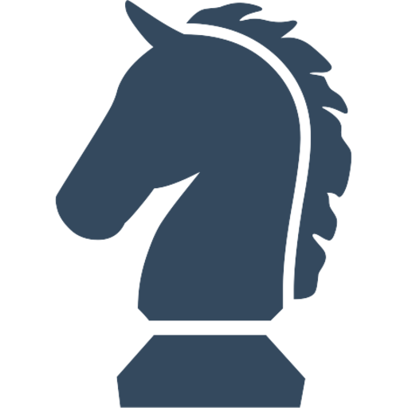
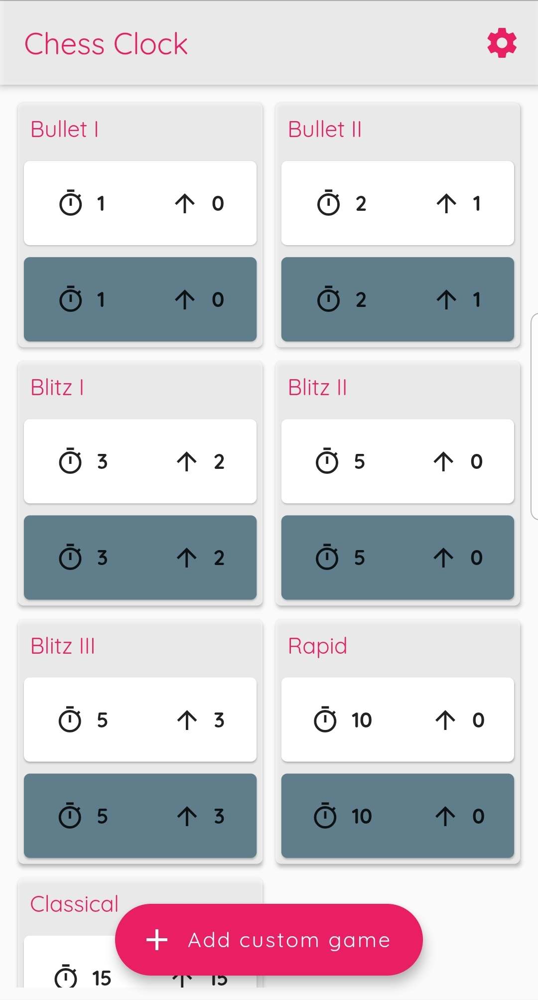
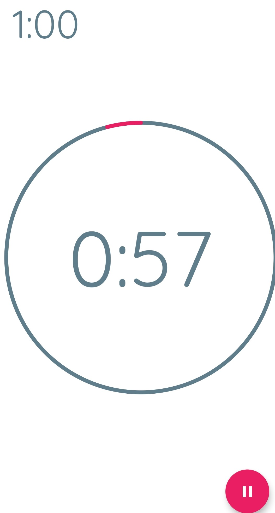
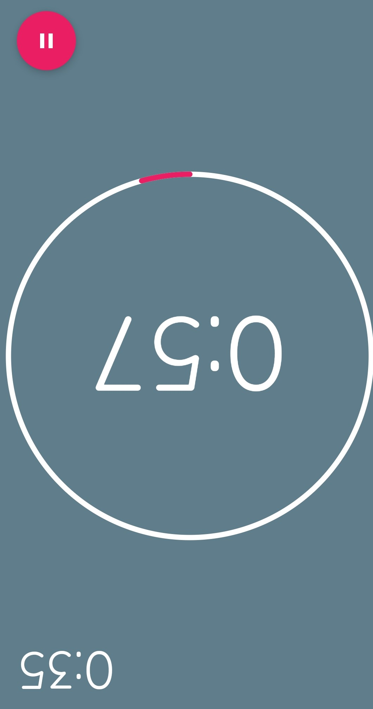

# chess_clock
 Simple **chess clock app** written with flutter.
 
 

- [Get the app in the Google Play Store.](https://play.google.com/store/apps/details?id=de.p_bre.marc.chess_clock)
- Soon to be released for ios.

[Clock design by Tensor Programming](https://www.youtube.com/channel/UCYqCZOwHbnPwyjawKfE21wg).
